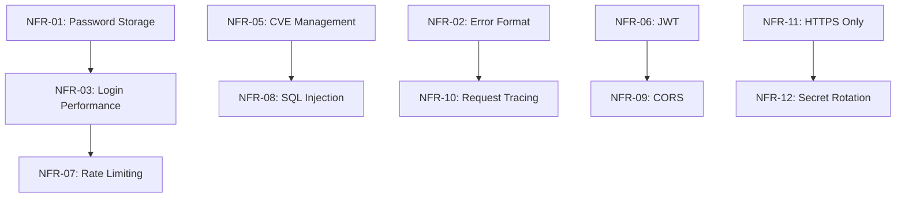

# NFR Traceability Matrix

## Цель документа
Связь Non-Functional Requirements с User Stories, Tasks, Issues и релизным планом для обеспечения прозрачности реализации и приоритизации.

---

## Матрица трассировки NFR → Stories/Tasks

| NFR ID | NFR Название                      | Story/Task ID | Story/Task Описание                           | Приоритет | Release    | Status      | Assignee       |
|--------|-----------------------------------|---------------|-----------------------------------------------|-----------|------------|-------------|----------------|
| NFR-01 | Хранение паролей                  | SEC-101       | Миграция на bcrypt rounds=12                  | Critical  | 2025.11 P04| Planned     | Backend Team   |
| NFR-01 | Хранение паролей                  | SEC-102       | Unit-тесты для password hashing               | Critical  | 2025.11 P04| Planned     | QA Team        |
| NFR-02 | Структурированные ошибки          | API-201       | Рефакторинг error handlers по RFC 7807        | High      | 2025.11 P04| In Progress | Backend Team   |
| NFR-02 | Структурированные ошибки          | API-202       | E2E тесты для error responses                 | High      | 2025.11 P04| Planned     | QA Team        |
| NFR-03 | Производительность /login         | PERF-301      | Настройка load testing инфраструктуры         | High      | 2025.11 P05| Planned     | DevOps Team    |
| NFR-03 | Производительность /login         | PERF-302      | Оптимизация bcrypt для балансировки security  | High      | 2025.12 P06| Backlog     | Backend Team   |
| NFR-04 | Производительность /wishes        | PERF-401      | Индексы БД для queries с фильтрацией          | High      | 2025.11 P05| Planned     | Backend Team   |
| NFR-04 | Производительность /wishes        | PERF-402      | Connection pooling настройка                  | High      | 2025.11 P05| Planned     | Backend Team   |
| NFR-05 | Уязвимости зависимостей           | SEC-501       | Интеграция pip-audit в CI                     | Critical  | 2025.10 P03| Done        | DevOps Team    |
| NFR-05 | Уязвимости зависимостей           | SEC-502       | Настройка Dependabot alerts                   | Critical  | 2025.10 P03| Done        | DevOps Team    |
| NFR-05 | Уязвимости зависимостей           | SEC-503       | SLA процесс для патчинга CVE                  | Critical  | 2025.11 P04| Planned     | Security Team  |
| NFR-06 | JWT токены                        | AUTH-601      | Валидация JWT configuration                   | High      | 2025.11 P04| Planned     | Backend Team   |
| NFR-06 | JWT токены                        | AUTH-602      | Integration тесты для JWT lifecycle           | High      | 2025.11 P04| Planned     | QA Team        |
| NFR-07 | Rate Limiting                     | SEC-701       | Реализация rate limiting middleware           | High      | 2025.12 P06| Backlog     | Backend Team   |
| NFR-07 | Rate Limiting                     | SEC-702       | Redis setup для distributed rate limiting     | High      | 2025.12 P06| Backlog     | DevOps Team    |
| NFR-08 | SQL Injection защита              | SEC-801       | Code audit: все queries через ORM             | Critical  | 2025.11 P04| Planned     | Security Team  |
| NFR-08 | SQL Injection защита              | SEC-802       | SAST интеграция (Semgrep/Bandit)              | Critical  | 2025.11 P04| Planned     | DevOps Team    |
| NFR-09 | CORS политика                     | API-901       | Настройка CORS whitelist для production       | High      | 2025.11 P05| Planned     | Backend Team   |
| NFR-10 | Request ID трассировка            | OBS-1001      | Валидация X-Request-ID во всех responses      | Medium    | 2025.11 P05| Planned     | Backend Team   |
| NFR-10 | Request ID трассировка            | OBS-1002      | Интеграция с centralized logging (ELK)        | Medium    | 2025.12 P07| Backlog     | DevOps Team    |
| NFR-11 | HTTPS только                      | INFRA-1101    | TLS 1.2+ enforcement на load balancer         | Critical  | 2026.01 P08| Backlog     | DevOps Team    |
| NFR-11 | HTTPS только                      | INFRA-1102    | HSTS header configuration                     | Critical  | 2026.01 P08| Backlog     | DevOps Team    |
| NFR-12 | Ротация секретов                  | OPS-1201      | Vault setup для secret management             | Medium    | 2026.02 P09| Backlog     | DevOps Team    |
| NFR-12 | Ротация секретов                  | OPS-1202      | Runbook для secret rotation процедуры         | Medium    | 2026.02 P09| Backlog     | Security Team  |

---

## Roadmap по релизам

### ✅ P03 (2025.10): Текущий - NFR Documentation
- **NFR-05**: Dependency scanning baseline (pip-audit, Dependabot)
- **Deliverables**: NFR.md, NFR_BDD.md, NFR_TRACEABILITY.md

### 🔄 P04 (2025.11): Critical Security Fixes
**Фокус**: Устранение критичных security gaps

| NFR    | Задачи                                               | Effort | Priority  |
|--------|------------------------------------------------------|--------|-----------|
| NFR-01 | SEC-101, SEC-102: bcrypt rounds=12 + тесты           | 3d     | Critical  |
| NFR-02 | API-201, API-202: RFC 7807 errors + тесты            | 5d     | High      |
| NFR-06 | AUTH-601, AUTH-602: JWT validation + тесты           | 3d     | High      |
| NFR-08 | SEC-801, SEC-802: SQL Injection audit + SAST         | 5d     | Critical  |

**Критерии выхода**: Все Critical NFR имеют passing тесты, SAST в CI

---

### 📋 P05 (2025.11-12): Performance & Observability
**Фокус**: Производительность и мониторинг

| NFR    | Задачи                                               | Effort | Priority  |
|--------|------------------------------------------------------|--------|-----------|
| NFR-03 | PERF-301: Load testing setup (k6)                    | 5d     | High      |
| NFR-04 | PERF-401, PERF-402: DB optimization                  | 7d     | High      |
| NFR-09 | API-901: CORS whitelist                              | 2d     | High      |
| NFR-10 | OBS-1001: Request ID validation                      | 2d     | Medium    |

**Критерии выхода**: p95 benchmarks установлены и проходят

---

### 🔮 P06 (2025.12): Advanced Security
**Фокус**: Rate limiting и дополнительная защита

| NFR    | Задачи                                               | Effort | Priority  |
|--------|------------------------------------------------------|--------|-----------|
| NFR-03 | PERF-302: bcrypt cost factor tuning                  | 3d     | High      |
| NFR-07 | SEC-701, SEC-702: Rate limiting + Redis              | 8d     | High      |

---

### 🚀 P07-P09 (2026.01-02): Infrastructure Hardening
**Фокус**: Production-ready инфраструктура

| Release | NFR Focus              | Key Tasks                                |
|---------|------------------------|------------------------------------------|
| P07     | NFR-10                 | Centralized logging (ELK/Loki)           |
| P08     | NFR-11                 | TLS enforcement, HSTS                    |
| P09     | NFR-12                 | Vault secret management, rotation        |

---

## Зависимости между NFR



### Критичные зависимости
- **NFR-01 → NFR-03**: Увеличение bcrypt rounds влияет на latency логина
- **NFR-05 → NFR-08**: SAST инструменты должны быть без уязвимостей
- **NFR-07 → NFR-03**: Rate limiting может влиять на performance метрики

---

## Связь с User Stories (примеры)

### Epic: Secure Authentication
```
US-001: Как пользователь, я хочу безопасно регистрироваться
├─ NFR-01: Хеширование паролей (SEC-101, SEC-102)
├─ NFR-02: Понятные ошибки при неверном формате (API-201)
└─ NFR-07: Защита от brute-force (SEC-701)

US-002: Как пользователь, я хочу быстро входить в систему
├─ NFR-03: Производительность логина (PERF-301, PERF-302)
└─ NFR-06: JWT токены с коротким TTL (AUTH-601)
```

### Epic: Wishlist Management
```
US-101: Как пользователь, я хочу управлять своими wishes
├─ NFR-04: Быстрый доступ к списку (PERF-401, PERF-402)
├─ NFR-08: Безопасный поиск/фильтрация (SEC-801)
└─ NFR-10: Трассировка запросов для troubleshooting (OBS-1001)

US-102: Как admin, я хочу видеть все wishes
├─ NFR-04: Производительность на больших датасетах (PERF-401)
└─ NFR-09: CORS для admin панели (API-901)
```

---

## Issue/Task Templates

### Template для Security NFR задачи
```markdown
**Title**: [SEC-XXX] Реализация NFR-XX: [Название]

**Labels**: security, nfr, priority-critical

**Description**:
- **NFR**: NFR-XX - [Название]
- **Цель**: [Краткое описание]
- **Acceptance Criteria**:
  - [ ] Метрика: [порог]
  - [ ] Тесты: [типы тестов]
  - [ ] Документация обновлена
  - [ ] Security review пройден

**Related**:
- NFR Doc: `docs/security-nfr/NFR.md#nfr-xx`
- BDD Scenario: `docs/security-nfr/NFR_BDD.md#feature-x`
```

---

## Метрики отслеживания прогресса

### Общий статус NFR реализации

| Метрика                           | Текущее значение | Целевое значение | Дедлайн |
|-----------------------------------|------------------|------------------|---------|
| NFR с полной реализацией          | 2/12 (17%)       | 12/12 (100%)     | P09     |
| NFR с автоматизированными тестами | 1/12 (8%)        | 12/12 (100%)     | P07     |
| Critical NFR выполнено            | 0/4 (0%)         | 4/4 (100%)       | P04     |
| High NFR выполнено                | 0/6 (0%)         | 6/6 (100%)       | P06     |

### Burn-down по релизам

```
P03: ████████████████████ 100% (Documentation done)
P04: ░░░░░░░░░░░░░░░░░░░░   0% (4 tasks planned)
P05: ░░░░░░░░░░░░░░░░░░░░   0% (4 tasks planned)
P06: ░░░░░░░░░░░░░░░░░░░░   0% (2 tasks planned)
P07-P09: ░░░░░░░░░░░░░░░░   0% (6 tasks backlog)
```

---

## Review & Approval Process

### Критерии approval для NFR реализации

1. **Code Review**: 2+ approvals (1 security engineer)
2. **Tests**: Все BDD сценарии passed
3. **Security Scan**: SAST/DAST без High/Critical findings
4. **Performance**: Benchmarks соответствуют порогам
5. **Documentation**: ADR и runbooks обновлены

### Stakeholders

| Role              | Responsibility                          | Contact         |
|-------------------|-----------------------------------------|-----------------|
| Security Engineer | NFR validation, security review         | @security-team  |
| Backend Lead      | Implementation oversight                | @backend-lead   |
| QA Lead           | Test automation, BDD scenarios          | @qa-lead        |
| DevOps Lead       | Infrastructure, CI/CD integration       | @devops-lead    |
| Product Owner     | Prioritization, release planning        | @product-owner  |

---

## Обновления документа

| Дата       | Версия | Автор          | Изменения                             |
|------------|--------|----------------|---------------------------------------|
| 2025-10-13 | 1.0    | Security Team  | Первая версия, все 12 NFR             |
| TBD        | 1.1    | -              | Обновление статусов после P04         |

---

**Владелец документа**: Product & Security Team
**Последнее обновление**: 2025-10-13
**Версия**: 1.0
