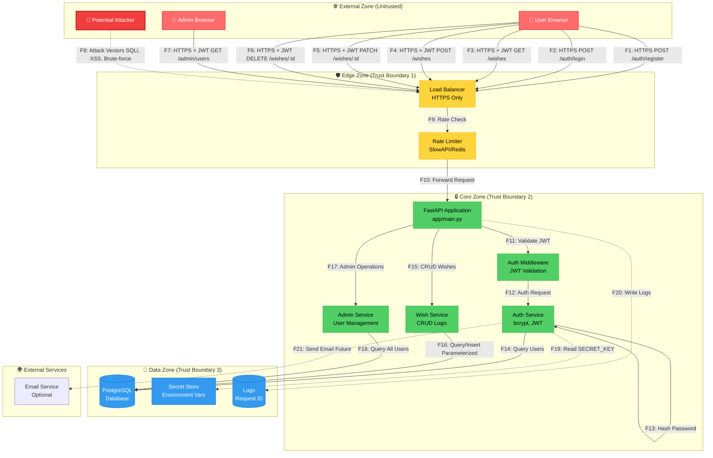
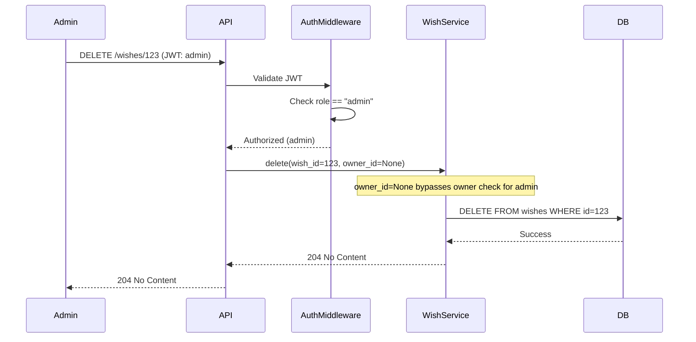

# Data Flow Diagram (DFD) — Wishlist API

## Цель документа
Визуализация архитектуры Wishlist API с выделением границ доверия, потоков данных и компонентов для последующего анализа угроз по STRIDE.

---

## Основная DFD схема

---

## Границы доверия (Trust Boundaries)

### 🌐 External Zone (Untrusted)
**Описание**: Публичный интернет, откуда приходят все запросы пользователей.

**Компоненты**:
- User Browser (клиент фронтенда)
- Admin Browser (админ панель)
- Potential Attacker (злоумышленник)

**Уровень доверия**: ❌ Не доверяем
**Контроли на границе**:
- HTTPS обязателен (TLS 1.2+)
- Input validation на всех endpoints
- CORS политика

---

### 🛡️ Edge Zone (Trust Boundary 1)
**Описание**: Периметр безопасности, первая линия защиты.

**Компоненты**:
- Load Balancer (NGINX/Traefik)
- Rate Limiter (SlowAPI + Redis)

**Уровень доверия**: ⚠️ Частично доверяем
**Контроли**:
- TLS termination
- Rate limiting (защита от brute-force)
- WAF rules (опционально)
- DDoS protection

**Входящие потоки**: F1-F8 (от External)
**Исходящие потоки**: F9-F10 (к Core)

---

### 🔒 Core Zone (Trust Boundary 2)
**Описание**: Бизнес-логика приложения, доверенная зона выполнения.

**Компоненты**:
- FastAPI Application
- Auth Middleware (JWT validation)
- Auth Service (authentication & authorization)
- Wish Service (CRUD операции)
- Admin Service (управление пользователями)

**Уровень доверия**: ✅ Доверяем
**Контроли**:
- JWT signature validation (HS256)
- Role-based access control (user/admin)
- Owner-based access (IDOR protection)
- SQLAlchemy ORM (SQL injection protection)
- Structured error handling (no stack traces)

**Входящие потоки**: F10 (от Edge)
**Исходящие потоки**: F13-F18 (к Data), F20-F21 (к External Services)

---

### 💾 Data Zone (Trust Boundary 3)
**Описание**: Хранилища данных и секретов.

**Компоненты**:
- PostgreSQL Database
- Secret Store (environment variables)
- Logs (structured JSON logs)

**Уровень доверия**: ✅ Максимально доверяем
**Контроли**:
- Database credentials защищены (env vars, будущее: Vault)
- Encrypted at rest (опционально)
- Backup & recovery процедуры
- Network isolation (не доступна из External)

**Входящие потоки**: F14, F16, F18, F19, F20
**Исходящие потоки**: Responses к Core

---

## Детальное описание потоков

### F1: POST /auth/register (User Registration)
- **Источник**: User Browser
- **Получатель**: API → Auth Service → DB
- **Протокол**: HTTPS
- **Данные**: `{email, username, password}` (JSON)
- **Аутентификация**: Нет
- **Контроли**:
  - Email validation (Pydantic EmailStr)
  - Password min length: 8 chars, max: 72 chars
  - Bcrypt hashing (будущее: rounds=12)
  - Duplicate check (email, username)
- **Угрозы**: S (spoofing), T (tampering), D (DoS)

---

### F2: POST /auth/login (Authentication)
- **Источник**: User Browser
- **Получатель**: API → Auth Service → DB
- **Протокол**: HTTPS
- **Данные**: `{username (email), password}` (form-data)
- **Аутентификация**: OAuth2PasswordRequestForm
- **Контроли**:
  - Rate limiting: 5 attempts/minute (будущее)
  - Bcrypt password verification
  - JWT token generation (TTL: 30 min)
- **Угрозы**: S (brute-force), I (info disclosure), D (DoS)

---

### F3: GET /wishes (Read Wishes)
- **Источник**: User Browser
- **Получатель**: API → Wish Service → DB
- **Протокол**: HTTPS
- **Данные**: Query params: `?limit=10&offset=0&price_filter=100`
- **Аутентификация**: Bearer JWT
- **Авторизация**: Owner-only (или admin видит все)
- **Контроли**:
  - JWT validation (signature, expiration)
  - Owner_id filter (IDOR protection)
  - Input validation (limit: 1-100, offset: ≥0, price: ≥0)
  - Parameterized queries (SQLAlchemy ORM)
- **Угрозы**: S (token theft), E (privilege escalation), I (data leak)

---

### F4: POST /wishes (Create Wish)
- **Источник**: User Browser
- **Получатель**: API → Wish Service → DB
- **Протокол**: HTTPS
- **Данные**: `{title, link, price_estimate, notes}` (JSON)
- **Аутентификация**: Bearer JWT
- **Авторизация**: Authenticated user
- **Контроли**:
  - JWT validation
  - Input validation (title: 1-200 chars, price: ≥0)
  - Owner_id from JWT (не от клиента!)
  - SQL injection protection (ORM)
- **Угрозы**: T (data manipulation), I (injection), R (repudiation)

---

### F5: PATCH /wishes/:id (Update Wish)
- **Источник**: User Browser
- **Получатель**: API → Wish Service → DB
- **Протокол**: HTTPS
- **Данные**: `{title?, link?, price_estimate?, notes?}` (JSON partial)
- **Аутентификация**: Bearer JWT
- **Авторизация**: Owner-only (или admin)
- **Контроли**:
  - JWT validation
  - Owner check (get_by_id с owner_id filter)
  - Input validation
  - IDOR protection
- **Угрозы**: E (unauthorized update), T (tampering)

---

### F6: DELETE /wishes/:id (Delete Wish)
- **Источник**: User Browser
- **Получатель**: API → Wish Service → DB
- **Протокол**: HTTPS
- **Данные**: Path param: `wish_id`
- **Аутентификация**: Bearer JWT
- **Авторизация**: Owner-only (или admin)
- **Контроли**:
  - JWT validation
  - Owner check перед удалением
  - 404 если не найдено или не владелец
- **Угрозы**: E (unauthorized deletion), R (no audit log)

---

### F7: GET /admin/users (Admin: List Users)
- **Источник**: Admin Browser
- **Получатель**: API → Admin Service → DB
- **Протокол**: HTTPS
- **Данные**: Нет (или query params для фильтрации)
- **Аутентификация**: Bearer JWT
- **Авторизация**: Admin role only
- **Контроли**:
  - JWT validation
  - Role check: `user.role == "admin"`
  - 403 Forbidden для non-admin
- **Угрозы**: E (privilege escalation), I (PII disclosure)

---

### F8: Attack Vectors (Malicious Traffic)
- **Источник**: Attacker
- **Получатель**: Edge → Core
- **Типы атак**:
  - SQL Injection (в query params, JSON body)
  - XSS (в title, notes)
  - Brute-force (на /login)
  - IDOR (изменение wish_id на чужие)
  - JWT tampering/replay
  - DoS (flood запросов)
- **Контроли**:
  - Input validation (Pydantic)
  - Output encoding (FastAPI автоматически)
  - Rate limiting
  - Parameterized queries (ORM)
  - JWT signature validation
  - CORS policy

---

### F14, F16, F18: Database Queries
- **Источник**: Auth/Wish/Admin Services
- **Получатель**: PostgreSQL DB
- **Протокол**: asyncpg (TLS опционально)
- **Контроли**:
  - Всегда parameterized queries через SQLAlchemy
  - Connection pooling (limit connections)
  - Credentials в environment variables
- **Угрозы**: I (SQL injection), T (data tampering), I (data leak)

---

### F19: Read SECRET_KEY
- **Источник**: Auth Service
- **Получатель**: Secrets (env vars)
- **Данные**: `SECRET_KEY`, `DATABASE_URL`
- **Контроли**:
  - Secrets не в коде (`.env` в `.gitignore`)
  - Будущее: Vault/KMS для production
- **Угрозы**: I (secret disclosure), E (use stolen secret)

---

### F20: Write Logs
- **Источник**: API Middleware
- **Получатель**: Logs (stdout → файл/ELK)
- **Данные**: `{timestamp, level, message, request_id, method, url, status_code}`
- **Контроли**:
  - PII masking (нет паролей, токенов в логах)
  - Structured JSON format
  - Request ID для корреляции
- **Угрозы**: I (log injection), R (log tampering)

---

## Альтернативный сценарий: Admin delete user's wish

**Особенности**:
- Admin может удалять чужие wishes
- `owner_id=None` в repository method для admin
- Требуется audit log (будущее) для отслеживания admin действий

---

## Assets (активы для защиты)

| Asset ID | Название                | Тип           | Критичность | Расположение        | Угрозы              |
|----------|-------------------------|---------------|-------------|---------------------|---------------------|
| A1       | User passwords (hashed) | Data          | Critical    | DB (users table)    | S, T, I             |
| A2       | JWT tokens              | Credentials   | High        | Client (browser)    | S, T, E             |
| A3       | User wishes data        | Data          | High        | DB (wishes table)   | T, I, E, R          |
| A4       | SECRET_KEY              | Secret        | Critical    | Env vars            | I, E                |
| A5       | Database credentials    | Secret        | Critical    | Env vars            | I, E                |
| A6       | User PII (email)        | Data          | High        | DB (users table)    | I, D (GDPR)         |
| A7       | API availability        | Service       | Medium      | Core Zone           | D                   |
| A8       | Request logs            | Data          | Medium      | Logs storage        | I, R, D             |

---

## Итоги

### Покрытие
- ✅ 3 границы доверия (External → Edge → Core → Data)
- ✅ 21 пронумерованный поток (F1-F21)
- ✅ 8 ключевых компонентов
- ✅ 8 активов для защиты

### Следующие шаги
- Детальный STRIDE анализ потоков (см. `STRIDE.md`)
- Оценка рисков и стратегии митигации (см. `RISKS.md`)
- Реализация контролей из NFR (P03)

---

**Владелец документа**: Security Team
**Последнее обновление**: 2025-10-13
**Версия**: 1.0
