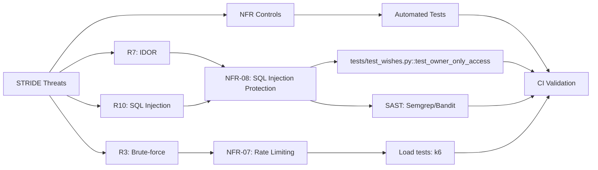

# STRIDE Threat Analysis — Wishlist API

## Цель документа
Систематический анализ угроз для ключевых потоков данных Wishlist API с использованием методологии STRIDE (Spoofing, Tampering, Repudiation, Information Disclosure, Denial of Service, Elevation of Privilege).

---

## STRIDE Matrix: Потоки и компоненты

| Поток/Элемент          | Угроза (STRIDE)                           | Risk ID | Контроль / Митигация                              | Ссылка на NFR      | Проверка/Артефакт                  |
|------------------------|-------------------------------------------|---------|---------------------------------------------------|--------------------|------------------------------------|
| **F1: POST /register** | **S**: Регистрация с fake/stolen email   | R1      | Email validation (EmailStr), CAPTCHA (будущее)    | NFR-02             | Unit tests + manual check          |
| F1                     | **D**: DoS через массовую регистрацию     | R2      | Rate limiting: 3 req/5min per IP                  | NFR-07 (planned)   | E2E tests + monitoring             |
| **F2: POST /login**    | **S**: Brute-force password guessing      | R3      | Rate limiting: 5 req/min per IP, bcrypt slow hash | NFR-01, NFR-07     | Load tests + fail2ban              |
| F2                     | **I**: Credential enumeration via errors  | R4      | Generic error: "Invalid credentials"              | NFR-02             | E2E tests для error responses      |
| F2                     | **D**: DoS via login flood                | R5      | Rate limiting + auto-block after N failures       | NFR-07 (planned)   | Load tests (k6)                    |
| **F3: GET /wishes**    | **S**: Stolen/forged JWT token            | R6      | JWT signature validation (HS256, SECRET_KEY)      | NFR-06             | Integration tests + JWT fuzzing    |
| F3                     | **E**: IDOR: access другого user's wishes | R7      | Owner_id check в query: `WHERE owner_id = user_id`| NFR-08             | IDOR tests (pytest)                |
| F3                     | **I**: Data leak (PII in wishes)          | R8      | RBAC: user sees only own, admin sees all          | NFR-09             | Authorization tests                |
| **F4: POST /wishes**   | **T**: Tamper owner_id (create for others)| R9      | Owner_id from JWT, NOT from request body          | NFR-08             | Unit tests + code review           |
| F4                     | **I**: SQL Injection в title/notes        | R10     | Parameterized queries (SQLAlchemy ORM)            | NFR-08             | SAST (Semgrep/Bandit) + pentest    |
| F4                     | **R**: Repudiation (no audit log)         | R11     | Request ID logging (X-Request-ID)                 | NFR-10             | Log analysis + SIEM integration    |
| **F5: PATCH /wishes**  | **E**: Unauthorized update of other's wish| R12     | Owner check: `get_by_id(wish_id, owner_id=user_id)`| NFR-08            | IDOR tests                         |
| F5                     | **T**: XSS injection в title              | R13     | Output encoding (FastAPI auto), input validation  | NFR-02             | XSS tests + ZAP scan               |
| **F6: DELETE /wishes** | **E**: Unauthorized deletion              | R14     | Owner check + 404 if not found/not owner          | NFR-08             | Authorization tests                |
| F6                     | **R**: No audit trail for deletions       | R15     | Log deletion events with request_id + user_id     | NFR-10             | Audit log tests                    |
| **F7: GET /admin**     | **E**: Privilege escalation (non-admin)   | R16     | Role check: `if user.role != "admin": raise 403`  | NFR-06, NFR-09     | RBAC tests + manual verification   |
| F7                     | **I**: Leak all users PII                 | R17     | Admin-only endpoint, HTTPS, no logs of PII        | NFR-11             | Security review + compliance check |
| **F14/F16/F18: DB**    | **I**: SQL Injection                      | R10     | 100% queries через ORM, no raw SQL                | NFR-08             | SAST + code review                 |
| DB Queries             | **T**: Connection hijacking               | R18     | TLS for DB connection (asyncpg SSL)               | NFR-11 (planned)   | Infrastructure review              |
| **F19: Secrets**       | **I**: Hardcoded SECRET_KEY in code       | R19     | Secrets in .env (gitignored), Vault (будущее)     | NFR-12             | Secret scanning (TruffleHog/Gitleaks)|
| F19                    | **E**: Use stolen SECRET_KEY              | R20     | Regular rotation (90 days), strong random key     | NFR-12             | Runbook + monitoring               |
| **F20: Logs**          | **I**: Log injection (fake request_id)    | R21     | Sanitize log inputs, structured JSON format       | NFR-10             | Log validation tests               |
| F20                    | **R**: Log tampering/deletion             | R22     | Immutable logs, centralized (ELK/Loki)            | NFR-10 (planned)   | SIEM configuration                 |

---

## Детальный анализ по STRIDE категориям

### 🎭 S - Spoofing Identity

#### F1: Fake Registration
- **Угроза**: Атакующий регистрируется с чужим email или фальшивыми данными
- **Сценарий**: Ботнет создает тысячи fake аккаунтов для спама или DoS
- **Контроль**:
  - Email validation (Pydantic EmailStr): `NFR-02`
  - CAPTCHA на /register (будущее): `NFR-07`
  - Email verification link (будущее)
- **Риск**: R1 (L=3, I=2) — средний
- **Проверка**: Unit tests для email validation, manual check CAPTCHA

#### F2: Brute-force Login
- **Угроза**: Перебор паролей для входа
- **Сценарий**: Атакующий пробует common passwords для известных emails
- **Контроль**:
  - Bcrypt slow hashing: `NFR-01`
  - Rate limiting: 5 attempts/min: `NFR-07` (planned)
  - Account lockout after N failures (будущее)
- **Риск**: R3 (L=4, I=4) — высокий
- **Проверка**: Load tests (k6), fail2ban configuration

#### F3: Stolen JWT Token
- **Угроза**: Использование украденного/подделанного JWT токена
- **Сценарий**: XSS или MITM атака для кражи токена из браузера
- **Контроль**:
  - JWT signature validation (HS256): `NFR-06`
  - Short TTL (30 min): `NFR-06`
  - HTTPS only: `NFR-11`
  - HttpOnly cookies (будущее)
- **Риск**: R6 (L=3, I=5) — высокий
- **Проверка**: Integration tests + JWT fuzzing (invalid signatures)

---

### 🔧 T - Tampering with Data

#### F4: Tamper owner_id
- **Угроза**: Создание wish от имени другого пользователя
- **Сценарий**: Клиент отправляет `{"owner_id": 999}` в POST /wishes
- **Контроль**:
  - Owner_id извлекается из JWT, НЕ из body: `NFR-08`
  - Input validation (owner_id не принимается от клиента)
- **Риск**: R9 (L=2, I=5) — средний
- **Проверка**: Unit tests + code review

#### F5: XSS Injection
- **Угроза**: Внедрение вредоносного JS в title/notes
- **Сценарий**: `` в title
- **Контроль**:
  - Output encoding (FastAPI автоматически для JSON)
  - Input validation (max length, санитизация): `NFR-02`
  - CSP headers (будущее)
- **Риск**: R13 (L=2, I=3) — низкий
- **Проверка**: XSS scanner (ZAP baseline)

#### DB: Connection Hijacking
- **Угроза**: Man-in-the-middle на DB connection
- **Сценарий**: Перехват credentials или data в transit
- **Контроль**:
  - TLS для asyncpg connection: `NFR-11` (planned)
  - Network isolation (DB в private subnet)
- **Риск**: R18 (L=1, I=5) — низкий
- **Проверка**: Infrastructure review + SSL Labs

---

### 🔍 R - Repudiation

#### F4/F6: No Audit Log
- **Угроза**: Пользователь отрицает создание/удаление wish
- **Сценарий**: "Я не создавал этот wish", нет доказательств
- **Контроль**:
  - Request ID logging (X-Request-ID): `NFR-10`
  - User_id + timestamp в логах
  - Будущее: audit trail в отдельной таблице
- **Риск**: R11, R15 (L=2, I=2) — низкий
- **Проверка**: Log analysis, SIEM queries

#### F20: Log Tampering
- **Угроза**: Изменение или удаление логов для сокрытия атаки
- **Сценарий**: Атакующий с доступом к серверу удаляет следы
- **Контроль**:
  - Immutable logs (write-once)
  - Centralized logging (ELK/Loki): `NFR-10` (planned)
  - File integrity monitoring (AIDE)
- **Риск**: R22 (L=2, I=4) — средний
- **Проверка**: SIEM configuration + retention policy

---

### 💡 I - Information Disclosure

#### F2: Credential Enumeration
- **Угроза**: Определение валидных emails через разные ошибки
- **Сценарий**: "User not found" vs "Invalid password"
- **Контроль**:
  - Generic error message: "Invalid credentials": `NFR-02`
  - Одинаковое время ответа для valid/invalid (будущее)
- **Риск**: R4 (L=3, I=3) — средний
- **Проверка**: E2E tests для error messages

#### F3: Data Leak (IDOR)
- **Угроза**: Доступ к чужим wishes через изменение wish_id
- **Сценарий**: GET /wishes/123 (чужой wish)
- **Контроль**:
  - Owner_id check в query: `WHERE owner_id = user_id`: `NFR-08`
  - 404 Not Found (не 403, чтобы не раскрывать существование)
- **Риск**: R7 (L=4, I=5) — критический
- **Проверка**: IDOR penetration tests (pytest)

#### F7: Admin PII Leak
- **Угроза**: Утечка всех user emails и данных через /admin endpoint
- **Сценарий**: Скомпрометированный admin аккаунт или уязвимость
- **Контроль**:
  - Admin-only role check: `NFR-06, NFR-09`
  - HTTPS only: `NFR-11`
  - Rate limiting на admin endpoints
  - No PII в логах (email masking)
- **Риск**: R17 (L=2, I=5) — высокий
- **Проверка**: RBAC tests + compliance review (GDPR)

#### F10/F16: SQL Injection
- **Угроза**: Извлечение всей БД через SQLi
- **Сценарий**: `/wishes?price_filter=1' OR '1'='1`
- **Контроль**:
  - 100% parameterized queries (SQLAlchemy ORM): `NFR-08`
  - Input validation (type checking)
  - SAST в CI (Semgrep, Bandit)
- **Риск**: R10 (L=2, I=5) — критический
- **Проверка**: SAST + SQLMap penetration test

#### F19: Hardcoded Secrets
- **Угроза**: SECRET_KEY или DB password в коде/git history
- **Сценарий**: Публичный репозиторий или скомпрометированный laptop
- **Контроль**:
  - Secrets в .env (gitignored): `NFR-12`
  - Secret scanning (TruffleHog, Gitleaks) в CI
  - Vault/KMS для production (будущее)
- **Риск**: R19 (L=2, I=5) — критический
- **Проверка**: Secret scanning в CI + code review

---

### 🚫 D - Denial of Service

#### F1: Registration Flood
- **Угроза**: Массовая регистрация для исчерпания ресурсов
- **Сценарий**: Ботнет создает миллионы аккаунтов
- **Контроль**:
  - Rate limiting: 3 registrations/5min per IP: `NFR-07` (planned)
  - CAPTCHA (будущее)
  - Мониторинг + auto-block suspicious IPs
- **Риск**: R2 (L=3, I=3) — средний
- **Проверка**: Load tests (k6) + monitoring alerts

#### F2: Login Flood
- **Угроза**: DoS через флуд login requests
- **Сценарий**: 10000 req/sec на /login
- **Контроль**:
  - Rate limiting: 5 req/min per IP: `NFR-07` (planned)
  - Bcrypt slow hashing (естественная защита): `NFR-01`
  - Connection pooling limits: `NFR-04`
- **Риск**: R5 (L=4, I=4) — высокий
- **Проверка**: Load tests (k6), `NFR-03` performance thresholds

#### API: Resource Exhaustion
- **Угроза**: Исчерпание DB connections или memory
- **Сценарий**: GET /wishes без pagination (возврат 100k wishes)
- **Контроль**:
  - Pagination enforced: limit ≤ 100, default = 10: `NFR-04`
  - DB connection pooling с limits
  - Memory limits в Docker
- **Риск**: R23 (L=3, I=4) — средний
- **Проверка**: Load tests + resource monitoring (Prometheus)

---

### 🔐 E - Elevation of Privilege

#### F3/F5/F6: IDOR (Owner Bypass)
- **Угроза**: Доступ/изменение/удаление чужих wishes
- **Сценарий**: Regular user пытается PATCH /wishes/999 (чужой)
- **Контроль**:
  - Owner check в repository methods: `NFR-08`
  - 404 Not Found для non-owners (не 403)
  - Admin bypass: `owner_id=None` в queries
- **Риск**: R7, R12, R14 (L=4, I=5) — критический
- **Проверка**: IDOR penetration tests (automated + manual)

#### F7: Role Escalation (Admin Endpoint)
- **Угроза**: Regular user получает доступ к admin функциям
- **Сценарий**: JWT tampering (изменение `role` claim) или уязвимость в RBAC
- **Контроль**:
  - JWT signature validation: `NFR-06`
  - Explicit role check в dependency: `get_current_admin_user`
  - 403 Forbidden для non-admin
- **Риск**: R16 (L=2, I=5) — критический
- **Проверка**: RBAC tests + JWT fuzzing

#### F19: Secret Theft → Admin Access
- **Угроза**: Украденный SECRET_KEY для forge admin JWT
- **Сценарий**: SECRET_KEY утек через git/logs → злоумышленник создает admin токен
- **Контроль**:
  - Strong random SECRET_KEY (min 256 bit): `NFR-06`
  - Regular rotation (90 days): `NFR-12`
  - Secret scanning в CI
  - Vault/KMS для production (будущее)
- **Риск**: R20 (L=2, I=5) — критический
- **Проверка**: Secret scanning + rotation runbook

---

## STRIDE Coverage Summary

| STRIDE Category           | Total Threats | Critical | High | Medium | Low | Покрытие NFR                |
|---------------------------|---------------|----------|------|--------|-----|-----------------------------|
| **S** - Spoofing          | 3             | 0        | 2    | 1      | 0   | NFR-01, NFR-02, NFR-06, NFR-07, NFR-11 |
| **T** - Tampering         | 3             | 0        | 0    | 2      | 1   | NFR-02, NFR-08, NFR-11      |
| **R** - Repudiation       | 2             | 0        | 0    | 1      | 1   | NFR-10                      |
| **I** - Info Disclosure   | 6             | 4        | 1    | 1      | 0   | NFR-02, NFR-06, NFR-08, NFR-11, NFR-12 |
| **D** - Denial of Service | 3             | 0        | 1    | 2      | 0   | NFR-01, NFR-03, NFR-04, NFR-07 |
| **E** - Privilege Escalation | 3          | 3        | 0    | 0      | 0   | NFR-06, NFR-08, NFR-09, NFR-12 |
| **TOTAL**                 | **20**        | **7**    | **4**| **7**  | **2**| **12 NFR**                  |

---

## Приоритетные угрозы для митигации

### 🔴 Critical Priority (Must Fix)

1. **R7, R12, R14**: IDOR attacks (owner bypass)
   - **Контроль**: Implemented (owner_id check)
   - **Действие**: Добавить больше IDOR penetration tests

2. **R10**: SQL Injection
   - **Контроль**: Implemented (SQLAlchemy ORM)
   - **Действие**: SAST в CI (Semgrep/Bandit), penetration test (SQLMap)

3. **R16**: Admin privilege escalation
   - **Контроль**: Implemented (role check)
   - **Действие**: Фuzz testing для JWT, RBAC audit

4. **R19, R20**: Secret disclosure/theft
   - **Контроль**: Partial (.env, gitignore)
   - **Действие**: Secret scanning в CI, Vault integration (P08)

### 🟡 High Priority (Fix Soon)

5. **R3**: Brute-force login
   - **Контроль**: Planned (NFR-07 rate limiting)
   - **Действие**: Implement rate limiting middleware (P06)

6. **R6**: Stolen JWT token
   - **Контроль**: Implemented (JWT validation)
   - **Действие**: Reduce TTL to 15 min, add refresh tokens

7. **R17**: Admin PII leak
   - **Контроль**: Implemented (admin role check)
   - **Действие**: Audit logs для admin actions, GDPR compliance review

---

## Связь STRIDE → NFR → Tests

---

**Владелец документа**: Security Team
**Последнее обновление**: 2025-10-13
**Версия**: 1.0
